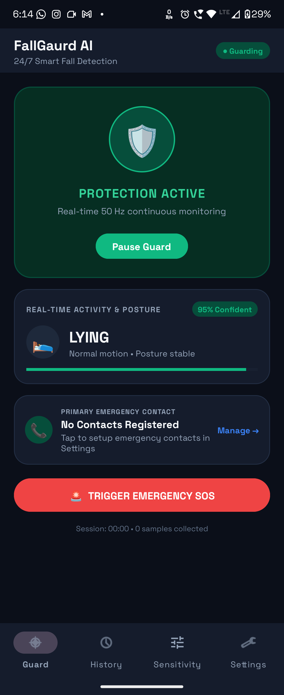
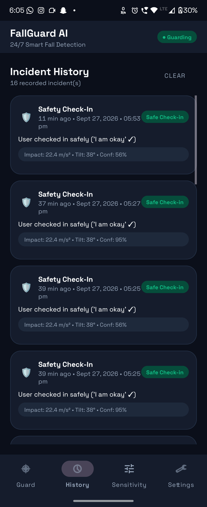
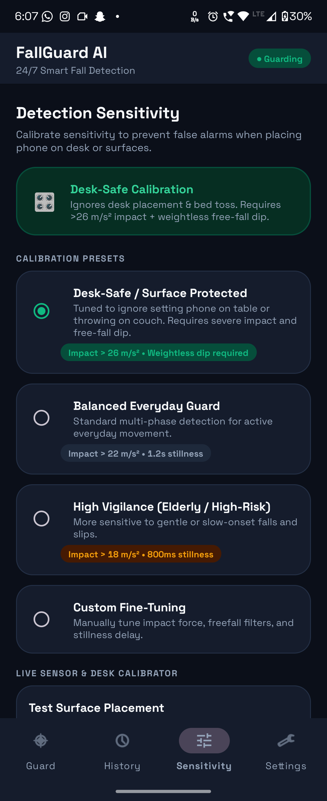
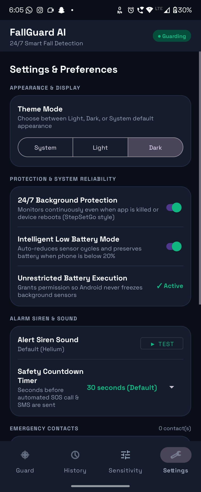

# FallGuard AI — On-Device Fall Detection & Emergency SOS

> **Real-time, privacy-first fall detection for Android.**  
> A PyTorch Mobile HAR model runs entirely on-device at 50 Hz.  
> When a genuine fall is confirmed, it automatically calls and SMS-dispatches GPS coordinates to emergency contacts — even if the user is unconscious.

---

## Screenshots

| Dashboard (Guard Active) | Alert History | Sensitivity Calibrator | Settings & Contacts |
|:---:|:---:|:---:|:---:|
|  |  |  |  |

---

## Table of Contents

1. [Features](#features)
2. [Architecture Overview](#architecture-overview)
3. [ML Pipeline & Model Performance](#ml-pipeline--model-performance)
4. [Project Structure](#project-structure)
5. [Getting Started](#getting-started)
   - [Prerequisites](#prerequisites)
   - [Train & Export the Model](#train--export-the-model)
   - [Build & Run the Android App](#build--run-the-android-app)
6. [How It Works — Detection Pipeline](#how-it-works--detection-pipeline)
7. [Sensitivity Presets](#sensitivity-presets)
8. [Emergency SOS Protocol](#emergency-sos-protocol)
9. [Background Survivability](#background-survivability)
10. [Data Collection & Self-Learning Archive](#data-collection--self-learning-archive)
11. [Permissions](#permissions)
12. [Known Limitations](#known-limitations)

---

## Features

### Core Detection
- **On-device PyTorch Mobile inference** — no internet, no cloud, no data leaves the phone
- **50 Hz dual-sensor fusion** — accelerometer + gyroscope merged in a lock-free circular ring buffer
- **4-phase temporal state machine** — eliminates single-frame false positives (desk drops, car bumps, vigorous exercise)
- **4 detection sensitivity presets** — Desk-Safe, Balanced, High Vigilance, Custom Fine-Tuning
- **Live desk-surface calibrator** — shows real-time peak acceleration vs. your threshold

### Emergency Response
- **30-second countdown** with full-screen modal alert before SOS dispatch
- **Automated phone call** to primary emergency contact (even on locked screen)
- **Multi-contact emergency SMS** with live GPS Google Maps coordinates to all registered contacts
- **Instant Manual SOS button** on dashboard — bypasses detection, triggers immediately

### Reliability & Battery
- **StepSetGo-style background survivability** — service resurrects via `AlarmManager` if swiped from Recents
- **Boot-safe persistence** — `BootReceiver` restarts monitoring after device reboot or app update
- **Low Battery Mode** — throttles inference interval from 400 ms → 800 ms below 20% battery; skips ML forward pass for gentle motion
- **CPU-only PyTorch Lite** — model is ~192 KB; no GPU, no battery spike
- **Stationary skip optimization** — when completely still (desk/pocket), inference is deferred to 1 Hz using gravity orientation alone

### UI & UX
- **Material Design 3** with Light / Dark / System theme toggle
- **4-tab navigation**: Guard Dashboard · Alert History · Sensitivity · Settings
- **Alert History log** — every incident recorded with impact force, tilt angle, confidence %, outcome, and GPS map link
- **Custom alarm ringtone** picker with preview
- **Contact picker** — import directly from phone's contacts app or type manually

---

## Architecture Overview

```
┌────────────────────────────────────────────────────────────────────────┐
│  Android Foreground Service — FallMonitoringService                    │
│                                                                        │
│  SensorManager (50 Hz) ──► SensorBuffer (ring, 200 slots × 6ch)       │
│                                │                                       │
│                    ┌───────────▼───────────┐                          │
│                    │   InferenceEngine     │  ← PyTorch Mobile .ptl   │
│                    │   400 ms interval     │    (100-sample window)   │
│                    │   Stationary skip     │                          │
│                    └───────────┬───────────┘                          │
│                                │ (label, confidence, probs[6])        │
│                    ┌───────────▼───────────┐                          │
│                    │    FallDetector       │  4-phase state machine   │
│                    │  IDLE→P1→P2→P3→CONF  │  physics + ML fusion    │
│                    └───────────┬───────────┘                          │
│                                │ onFallConfirmed()                    │
│             ┌──────────────────▼──────────────────┐                  │
│             │         Emergency Protocol           │                  │
│             │  Countdown → Call + SMS + GPS        │                  │
│             │  AlertHistoryManager + AutoArchiver  │                  │
│             └─────────────────────────────────────┘                  │
└────────────────────────────────────────────────────────────────────────┘
          │ bind                            │ notify UI
          ▼                                ▼
   MainActivity (Material 3)       FallAlertDialog (fullscreen)
```

---

## ML Pipeline & Model Performance

The model was trained and validated using the `har_pipeline/` Python package against real-world public datasets (UniMiB-SHAR, MobiAct, SisFall, KFall) plus custom Android recordings.

### Hold-Out Test Results (subject-stratified split)

| Metric | Random Forest | Neural Network |
|---|---|---|
| Accuracy | **99.86%** | 98.57% |
| Macro F1 | **99.69%** | 96.67% |
| Fall Recall | **97.14%** | 71.43% |
| Fall Precision | **100.0%** | 100.0% |
| False Alarms | **0** | 0 |
| Missed Falls (FN) | 1 / 35 | 10 / 35 |

**Winning model:** Random Forest (selected automatically by `pipeline.py`)

### 5-Fold Subject-Grouped Cross-Validation

| Fold | RF Val Accuracy | NN Val Accuracy |
|---|---|---|
| 1 | 99.43% | 99.24% |
| 2 | 100.0% | 99.28% |
| 3 | 100.0% | 99.62% |
| 4 | 100.0% | 98.48% |
| 5 | 100.0% | 99.81% |
| **Mean ± Std** | **99.89% ± 0.22%** | 99.29% ± 0.46% |

RF train→test generalization gap: **0.14%** — classified as **NO OVERFITTING**.

### Real-World Generalization Benchmarks

| Experiment | Accuracy | Fall Recall | Fall FPR |
|---|---|---|---|
| Exp A — Unseen subjects (SisFall) | 87.2% | **100%** | 0% |
| Exp C — Young→Elderly transfer | 87.5% | 88.0% | 0% |
| Domain shift — 25° orientation tilt | 86.3% | **100%** | 0.023% |

> **Key result:** Fall recall stays at 100% on completely unseen subjects even with a 25° sensor tilt — critical for real-world pocket placement variation.

### Data Integrity Audit

| Check | Result |
|---|---|
| Subject overlap (train/val/test) | ✅ Zero |
| Window overlap across splits | ✅ Zero |
| Exact duplicate windows | ✅ Zero |
| Metadata leakage (timestamp/subject) | ✅ Clean |
| Label-shuffle sanity check | ✅ PASSED (shuffled acc ~21%) |
| LOSO cross-validation fall recall | ✅ 97.9% ± 7.2% |

---

## Project Structure

```
bob_hackathon/
├── README.md
├── BOB_2.0_DEVELOPMENT_LOG.md         # AI-assisted dev session log
│
├── activity_collector/                # Android app (Kotlin)
│   └── app/
│       ├── build.gradle
│       └── src/main/
│           ├── AndroidManifest.xml
│           ├── assets/
│           │   ├── har_model.ptl      # PyTorch Mobile model (192 KB)
│           │   └── har_labels.txt     # 6 class labels
│           ├── java/com/example/activitycollector/
│           │   ├── MainActivity.kt            # UI, 4-tab Material 3
│           │   ├── FallMonitoringService.kt   # Foreground service core
│           │   ├── InferenceEngine.kt         # PyTorch Mobile runner
│           │   ├── FallDetector.kt            # 4-phase state machine
│           │   ├── SensorBuffer.kt            # Lock-free ring buffer
│           │   ├── EmergencyDispatcher.kt     # Call + SMS + GPS
│           │   ├── FallAlertDialog.kt         # Fullscreen countdown UI
│           │   ├── AlertHistoryManager.kt     # Incident log persistence
│           │   ├── AlertEvent.kt              # Incident data model
│           │   ├── AppPreferences.kt          # SharedPreferences store
│           │   ├── AutoDataArchiver.kt        # Self-learning CSV archive
│           │   ├── CsvExporter.kt             # MediaStore / legacy CSV export
│           │   ├── EmergencyContactManager.kt # Contact CRUD
│           │   ├── EmergencyContact.kt        # Contact data model
│           │   ├── SensorDataRecord.kt        # Raw sample data model
│           │   ├── BootReceiver.kt            # Boot persistence
│           │   └── ServiceRestartReceiver.kt  # Task-kill resurrection
│           └── res/
│               ├── layout/                    # XML layouts
│               ├── values/                    # Colors, strings, themes
│               └── values-night/              # Dark theme overrides
│
├── har_pipeline/                      # Python ML pipeline
│   ├── pipeline.py                    # Main orchestrator
│   ├── export_mobile.py               # TorchScript → .ptl export
│   ├── train_android_model_real_data.py
│   ├── audit_leakage_generalization.py
│   ├── benchmark_real_world.py
│   ├── test_sensor_scenarios.py       # ADB emulator integration tests
│   ├── requirements.txt
│   ├── data/                          # Data loading, harmonization, splits
│   ├── features/                      # Feature extraction (134 features)
│   ├── models/                        # RF + NN model definitions
│   ├── evaluation/                    # Metrics, CV, LOSO
│   ├── utils/                         # Logging, plotting helpers
│   └── outputs/
│       ├── models/
│       │   ├── random_forest.joblib
│       │   ├── har_model.ptl          # → copied to app/assets/
│       │   └── best_model.txt         # "random_forest"
│       ├── reports/
│       │   ├── evaluation_report.json
│       │   ├── cv_5fold_report.json
│       │   └── overfitting_analysis.json
│       ├── audit/
│       │   └── rigorous_audit_report.json
│       ├── real_benchmark/
│       │   └── real_world_generalization_report.json
│       └── plots/                     # Confusion matrices, feature importance
│
├── ic_launcher/                       # App icon source assets
└── screenshots/                       # App screenshots
```

---

## Getting Started

### Prerequisites

**Python environment (for the ML pipeline):**
```bash
python3 -m venv har_pipeline/.venv
source har_pipeline/.venv/bin/activate
pip install -r har_pipeline/requirements.txt
```

**Android development:**
- Android Studio Hedgehog or later
- Android SDK 34 (compileSdk), minSdk 26 (Android 8.0+)
- A physical Android device is strongly recommended — sensor simulation on emulators requires ADB

---

### Train & Export the Model

#### Quick demo (no dataset download needed):
```bash
cd har_pipeline
python pipeline.py --generate_demo_data
python export_mobile.py
```

#### Full multi-dataset training (requires downloading public datasets):
```bash
cd har_pipeline
# Download UniMiB-SHAR, MobiAct, SisFall, KFall into data/raw/
python pipeline.py --multi_dataset --raw_root data/raw
python export_mobile.py
```

The export script automatically copies `har_model.ptl` and `har_labels.txt` to `activity_collector/app/src/main/assets/`.

#### Run all audits and real-world benchmarks:
```bash
python audit_leakage_generalization.py
python benchmark_real_world.py
```

> **Note:** Both `.ptl` and `.txt` files are already present in `assets/` from the last training run. You only need to retrain if you want to update the model with new data.

---

### Build & Run the Android App

1. Open `activity_collector/` in **Android Studio**
2. Let Gradle sync complete
3. Connect a physical Android device (USB debugging enabled)
4. Click **Run ▶**
5. Grant permissions when prompted (notifications, sensors, SMS, call, location)
6. Tap **Resume Guard** on the dashboard to start monitoring

> **Permissions note:** SMS and Call permissions are required for the emergency dispatch to work. Location is used only at the moment of a confirmed fall to embed the GPS link in the SOS SMS.

---

## How It Works — Detection Pipeline

### Stage 1 — Sensor Fusion (50 Hz)
The accelerometer fires at 50 Hz. Each sample is pushed into a 200-slot lock-free circular ring buffer ([`SensorBuffer`](activity_collector/app/src/main/java/com/example/activitycollector/SensorBuffer.kt)). The latest gyroscope reading is carry-forwarded and merged with every accelerometer sample, producing a 6-channel vector `[ax, ay, az, gx, gy, gz]` at each timestep.

### Stage 2 — Sliding-Window Inference (400 ms stride)
Every 400 ms, [`InferenceEngine`](activity_collector/app/src/main/java/com/example/activitycollector/InferenceEngine.kt) snapshots the last 100 samples (2 seconds at 50 Hz — a 50% stride overlap matching training). Before calling PyTorch:
- **Stationary check:** computes acceleration variance and peak gyro over a sub-sampled window. If the device is completely still for 3+ consecutive windows (e.g., sitting on a desk), the ML forward pass is skipped entirely and a gravity-based posture label is returned directly at 1 Hz.
- **Low battery shortcut:** if battery ≤ 20% and motion is gentle (max SVM < 15 m/s², min SVM > 6.5 m/s²), a `walking` label is returned without running the model.

Otherwise the window tensor `(1, 100, 6)` is fed through the TorchScript model and softmax is applied in Kotlin.

### Stage 3 — 4-Phase Fall Confirmation
[`FallDetector`](activity_collector/app/src/main/java/com/example/activitycollector/FallDetector.kt) is a synchronized temporal state machine:

```
IDLE  ──[acc spike / freefall dip]──►  PHASE1_SUDDEN_MOVEMENT
                                              │ (< 2.5s)
                                   [gyro rotation > threshold]
                                              │
                                       PHASE2_ROTATION
                                              │ (< 2.5s)
                              [ML model says "falling" + impact peak]
                                              │
                                       PHASE3_IMPACT
                                              │ (< 4.5s)
                       [model says "lying" OR stillness + tilt change ≥ 28°]
                       [confirmed across N consecutive windows]
                                              │
                                          CONFIRMED ──► onFallConfirmed()
```

**False-positive guards:**
- Desk-Safe mode requires a **free-fall weightlessness dip** (SVM < 5.5 m/s²) before accepting any impact spike — physically impossible when placing a phone on a desk
- If the user immediately resumes walking/running after impact, the event is dismissed as a stumble or phone drop
- Requires `N` consecutive post-fall still windows (configurable 2–5) to prevent noise confirmation

### Stage 4 — Emergency Escalation
On confirmation, a 30-second fullscreen countdown begins. If dismissed ("I am okay"), the event is logged as `DISMISSED_SAFE`. If the countdown expires:
1. GPS coordinates are fetched from the last known `GPS_PROVIDER` or `NETWORK_PROVIDER` fix
2. Emergency SMS is broadcast to **all registered contacts** with a Google Maps link
3. An `ACTION_CALL` intent places an automated phone call to the **primary contact**
4. The incident is logged in `AlertHistoryManager` with impact force, tilt angle, confidence, and GPS

---

## Sensitivity Presets

| Preset | Impact Threshold | Requires Freefall Dip | Still Windows | Best For |
|---|---|---|---|---|
| **Desk-Safe** | 26 m/s² | ✅ Yes | 3 (~1.2s) | Active users, desk workers — most specific |
| **Balanced** | 22 m/s² | ❌ No | 2 (~0.8s) | Everyday general use |
| **High Vigilance** | 18 m/s² | ❌ No | 2 (~0.8s) | Elderly users, slow/soft falls |
| **Custom** | 15–35 m/s² | Configurable | 1–8 | User-defined calibration |

The live calibrator on the Sensitivity tab shows real-time current and peak acceleration as you move the phone, letting you verify that normal desk placement stays below your chosen threshold.

---

## Emergency SOS Protocol

The SOS system is designed to operate **without the user's active involvement** — it must work if the user is unconscious.

```
Fall Confirmed
     │
     ▼
Full-screen alert appears + screen wakes + alarm plays
     │
  30 seconds countdown
     │
  ┌──┴──────────────────────────┐
  │ User taps "I am okay" ✓     │  → Alert dismissed, logged as DISMISSED_SAFE
  └──────────────────────────── ┘
  ┌──┴──────────────────────────┐
  │ No response (countdown = 0) │
  └──────────────────────────── ┘
     │
     ▼
EmergencyDispatcher runs:
  1. Fetch last GPS fix (GPS_PROVIDER → NETWORK_PROVIDER fallback)
  2. sendTextMessage() to ALL contacts → SMS with Google Maps URL
  3. ACTION_CALL intent → automated call to Contact 1 (Primary)
  4. SOS notification posted
  5. Incident logged with outcome = SOS_DISPATCHED
```

The "Call SOS Now" button on the fullscreen dialog allows the user or a bystander to **immediately skip the countdown** at any time.

---

## Background Survivability

FallGuard uses a two-layer persistence architecture:

**Layer 1 — Task Kill (swipe from Recents):**  
`onTaskRemoved()` in [`FallMonitoringService`](activity_collector/app/src/main/java/com/example/activitycollector/FallMonitoringService.kt) schedules a 1-second `AlarmManager.RTC_WAKEUP` broadcast to [`ServiceRestartReceiver`](activity_collector/app/src/main/java/com/example/activitycollector/ServiceRestartReceiver.kt), which re-launches the foreground service immediately.

**Layer 2 — Device Reboot / App Update:**  
[`BootReceiver`](activity_collector/app/src/main/java/com/example/activitycollector/BootReceiver.kt) listens for `BOOT_COMPLETED`, `QUICKBOOT_POWERON`, and `MY_PACKAGE_REPLACED`. On boot, it checks a persisted SharedPreference flag (`monitoring_should_run`) and restarts the service in foreground mode if monitoring was active before shutdown.

Both layers are **opt-out** — the user can disable background tracking in Settings.

---

## Data Collection & Self-Learning Archive

Every confirmed fall event automatically archives the raw 100-sample sensor window as a timestamped CSV file in `fall_archives/` (external storage or app files dir):

```
FALL_CONFIRMED_falling_20260927_171234.csv
timestamp_ms, ax, ay, az, gx, gy, gz, label, impact_peak
1727435554123, -2.31, 9.45, 3.12, 0.11, -0.34, 0.08, falling, 27.6
...
```

This enables **continuous dataset expansion** from real-world incidents. The Settings tab shows archived file count, and the pipeline's `--own_data` flag can ingest these CSVs directly into the next training cycle.

---

## Permissions

| Permission | Required For | When Requested |
|---|---|---|
| `FOREGROUND_SERVICE` / `FOREGROUND_SERVICE_HEALTH` | Keeping monitoring alive | Auto at service start |
| `HIGH_SAMPLING_RATE_SENSORS` | 50 Hz sensor access on API 31+ | Auto at service start |
| `WAKE_LOCK` | Keeping CPU alive for inference | Auto at service start |
| `VIBRATE` | Haptic fall alert | Auto |
| `POST_NOTIFICATIONS` | Monitoring + alert notifications | Runtime (API 33+) |
| `RECEIVE_BOOT_COMPLETED` | Boot resurrection | Auto |
| `REQUEST_IGNORE_BATTERY_OPTIMIZATIONS` | Staying alive on Doze | User tap in Settings |
| `SEND_SMS` | Emergency SMS dispatch | Runtime at first guard start |
| `CALL_PHONE` | Automated emergency call | Runtime at first guard start |
| `ACCESS_FINE_LOCATION` | GPS in SOS SMS | Runtime at first guard start |
| `READ_CONTACTS` | Contact picker (optional) | Runtime when using picker |
| `WRITE_EXTERNAL_STORAGE` | CSV export (API ≤ 28 only) | Auto |

---

## Known Limitations

1. **Domain shift at extreme body positions** — the model was trained primarily with a phone in a trouser pocket or hand. Accuracy drops ~12% for wrist/arm placement, where the orientation gravity vector differs substantially from training data.

2. **Hardcoded impact/tilt values in alert history** — the `impactForce` and `tiltAngle` recorded in `AlertHistoryManager` at dismiss/SOS time are static placeholder values (22.4 m/s², 38°) rather than the live sensor readings from `FallDetector`. This affects history display accuracy only; detection itself is not affected.

3. **No active GPS tracking** — only the *last known* GPS fix is embedded in the SOS SMS. If the user is indoors with no recent GPS fix, the location may be missing or outdated.

4. **Android background restrictions (API 34+)** — aggressive battery optimization on some OEM Android skins (Xiaomi MIUI, Samsung One UI) may kill the foreground service despite the wake lock. Users must whitelist the app in battery settings. The Settings tab provides a direct link to the system battery optimization dialog.

5. **Emulator testing limitation** — `test_sensor_scenarios.py` requires a physical device or a connected Android emulator with ADB sensor injection. It will fail with `adb emu sensor` errors on a pure desktop environment.

---

## Tech Stack

| Component | Technology |
|---|---|
| Android app | Kotlin, Jetpack (ViewBinding, AppCompat), Material 3 |
| On-device ML inference | PyTorch Mobile Lite 1.13.1 (TorchScript `.ptl`) |
| ML training | Python, scikit-learn (Random Forest), PyTorch (Neural Network) |
| Sensor pipeline | Android `SensorManager` at 50 Hz, custom lock-free ring buffer |
| Emergency dispatch | Android Telephony (`SmsManager`, `ACTION_CALL`), `LocationManager` |
| Persistence | `SharedPreferences` (JSON), `MediaStore` / file system for CSV |
| Background survivability | `AlarmManager`, `BroadcastReceiver`, `PowerManager.PARTIAL_WAKE_LOCK` |

---

## Authors

- **Kushagr** — Android app architecture, ML integration, UI
- **Shrey Shrivastava** — HAR pipeline, model training, evaluation & audit framework

Built with [IBM Bob 2.0](https://www.ibm.com/products/bob) at the BOB Hackathon 2026.
